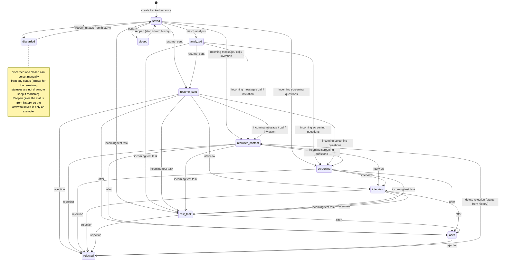

# Tracked Vacancy: statuses and automatic transitions

This document describes how the status of a tracked vacancy (`TrackedVacancy`) changes: what the user does, what the system does automatically, and what is forbidden.

## 1. Three independent axes

The state of a tracked vacancy consists of three independent fields. They do not have to change together: a vacancy can be `analyzed` + `consider_later`.

| Field | Meaning | Who changes it |
|---|---|---|
| `status` | Where the vacancy is in the process (see section 3) | Automatically from interactions, or manually (section 4) |
| `priority` | `low` / `medium` / `high` — the ranking | The user (rejection also sets `low`) |
| `decision` | `interested` / `consider_later` / `not_interested` — the decision | The user (except rejection, see below) |

Dates: `applied_at` (when the resume was sent), `closed_at` (when work on the vacancy ended), `next_action_at` (reminder).

## 2. Life cycle in words

1. The vacancy is added to the catalog and, optionally, analyzed separately: this is not tracking yet.
2. When the user decides to apply, a tracked vacancy is created: vacancy × a specific resume. Initial values: `saved`, `priority=low`, `decision=interested`.
3. The match analysis moves `saved` → `analyzed`. It does not change `priority` or `decision`.
4. Then the user decides: apply, postpone (`consider_later`), or discard.
5. After applying, interactions move the status: messages, interviews, test tasks, an offer, a rejection.
6. Work on a vacancy can end in several ways: the company rejects (`rejected`), the user discards it (`discarded`), or the vacancy is closed (`closed`).

Contact with a recruiter starts when **they** write or call. Outgoing messages and resume submissions do not count as contact: they may be handled by an ATS or a bot.

## 3. Statuses

| Status | Meaning | How it arises |
|---|---|---|
| `saved` | The vacancy is saved | Creating the tracked vacancy |
| `analyzed` | Match analysis has been done | Automatically after the match analysis from `saved` |
| `resume_sent` | Resume has been sent | Interaction `resume_sent` |
| `recruiter_contact` | The recruiter got in touch | Incoming `message`, `call`, `interview_invitation` |
| `screening` | Incoming screening questions | Incoming `screening_questions` |
| `interview` | The interview stage has started (scheduled or completed; details are in interactions) | `hr_interview`, `technical_interview`, `final_interview` |
| `test_task` | A test task has been received | Incoming `test_task` |
| `offer` | An offer has been received | Incoming `offer` |
| `rejected` | Rejected (or the user withdrew) | Interaction `rejection` |
| `discarded` | Discarded by the user's own decision | Manual only |
| `closed` | The vacancy is closed, there is no point in pursuing it | Manual only |

`rejected`, `discarded`, `closed` are terminal.

## 4. Manual actions on the status

Through `PATCH` on the tracked vacancy, only `discarded` or `closed` can be set. Other actions:

- `discarded` or `closed` from any status;
- returning a `discarded` or `closed` tracked vacancy to work is a separate action, `POST /tracked-vacancies/{id}/reopen`. The status and dates are recalculated from the interaction history (section 8). This is not possible through `PATCH`: setting `saved` or `analyzed` on a closed tracked vacancy returns `409`;
- all other statuses (`resume_sent` … `offer`, `rejected`) are not set manually: only interactions produce them. An attempt returns `409`.

Removing a mistaken rejection (`rejected`) is possible only by deleting the `rejection` interaction: the status is then recalculated from the rest of the history. `PATCH` does not help here, because the rejection stays in the history and the recalculation would give `rejected` again.

The "Discard" and "Close" actions on the frontend should set several fields together:

| Action | Fields |
|---|---|
| Discard | `status=discarded`, `priority=low`, `decision=not_interested` |
| Close | `status=closed`, `decision=not_interested` |

If `closed_at` is not provided, the backend sets it itself to "now". This is the moment the user noticed the closing, not the historical date when the vacancy was closed on the website.

Through `PATCH` on the tracked vacancy, the fields `applied_at`, `closed_at` and `next_action_at` can be set manually. They may diverge from the history until the next recalculation (section 8).

## 5. Interactions: direction rules

| Type | Rule |
|---|---|
| `resume_sent` | Only `outgoing`; only one per tracked vacancy |
| `offer` | Only `incoming` |
| `rejection` | Direction is required (the candidate can also reject) |
| Others | Direction is optional |

Violating a direction rule returns `400`; violating a status rule returns `409` (section 7).

## 6. Automatic transitions

During a recalculation (deleting an interaction, changing `occurred_at`, reopening), the rules are applied in `occurred_at` order (ties broken by id). The initial status is `analyzed` if a match analysis exists, otherwise `saved`.

When a new interaction is created, the rule is applied to the current status, and events are processed in the order they were entered. So the status after creation can differ from what a recalculation by dates would give (see section 8).

| Event | From statuses | New status |
|---|---|---|
| `resume_sent` (outgoing) | `saved`, `analyzed` | `resume_sent` |
| `message`, `call`, `interview_invitation` (incoming) | `saved`, `analyzed`, `resume_sent` | `recruiter_contact` |
| `screening_questions` (incoming) | `saved`, `analyzed`, `resume_sent`, `recruiter_contact` | `screening` |
| `hr_interview`, `technical_interview`, `final_interview` (any direction) | `resume_sent`, `recruiter_contact`, `screening`, `test_task` | `interview` |
| `test_task` (incoming) | `saved`, `analyzed`, `resume_sent`, `recruiter_contact`, `screening`, `interview` | `test_task` |
| `offer` (incoming) | `resume_sent`, `recruiter_contact`, `screening`, `interview`, `test_task`, `offer` | `offer` |
| `rejection` | `resume_sent`, `recruiter_contact`, `screening`, `interview`, `test_task`, `offer` | `rejected` |

Side effects:

- `resume_sent`: `applied_at` = the event date.
- `rejection`: `closed_at` = the event date; on creation also `priority=low`, `decision=not_interested`.

Types that do **not** change the status: `feedback`, `offer_discussion`, and outgoing `message`/`call`/`screening_questions`/`test_task`/`interview_invitation`.

Same-state transitions are ignored: if the tracked vacancy is already in the status the rule leads to, nothing changes.

## 7. Restrictions

| What | Forbidden when |
|---|---|
| `hr_interview`, `technical_interview`, `final_interview` | Status is `saved` or `analyzed` (a first contact must come first) |
| `offer`, `offer_discussion` | Status is `saved`, `analyzed`, `rejected`, `discarded`, `closed` |
| `rejection` | Status is `saved`, `analyzed`, `rejected`, `discarded`, `closed` |
| Everything except `message`, `call`, `feedback` | Status is `rejected`, `discarded`, `closed` |
| A second `resume_sent` | One already exists on this tracked vacancy |

Codes: status restrictions return `409`; direction violations return `400`.

To continue work on a closed tracked vacancy: for `discarded` and `closed`, first call `POST /tracked-vacancies/{id}/reopen`; for `rejected`, first delete the `rejection` interaction (`reopen` does not work for it).

`feedback` is always allowed and does not change the status: feedback often arrives after a rejection. The final "we are going with other candidates" is a `rejection` (write the reason in `message_text`), not `feedback`.

## 8. Editing, deleting and dates

- `PATCH /tracked-vacancies/interactions/{id}` accepts only `summary`, `message_text`, `occurred_at`. Other fields (including `interaction_type` and `direction`) return `422`: to fix a mistake, delete the interaction via `DELETE /tracked-vacancies/interactions/{id}` and enter it again.
- After deleting an interaction, after changing `occurred_at`, and after `reopen`, the status is recalculated: the whole remaining interaction history is taken in `occurred_at` order (ties broken by id) and run through the table in section 6. Interactions without a date go to the end. Manual `discarded` and `closed` are not touched by the recalculation.
- `priority` and `decision` are not changed by the recalculation. After deleting a `rejection` they stay `low` and `not_interested`, and must be set manually.
- `applied_at` = the date of `resume_sent`, `closed_at` = the date of `rejection`. These fields are synchronized during a recalculation: changing `occurred_at` on such an interaction, deleting `resume_sent` (clears `applied_at`), or deleting `rejection` (clears `closed_at`). For `discarded` and `closed`, `closed_at` is not touched: it is the user's manual closing date.
- After a recalculation the result depends on dates, not on the order of entry. When a new interaction is created, the order of entry does affect the status (section 6), so enter events chronologically: then the status matches what a recalculation would give.

## 9. State diagram

