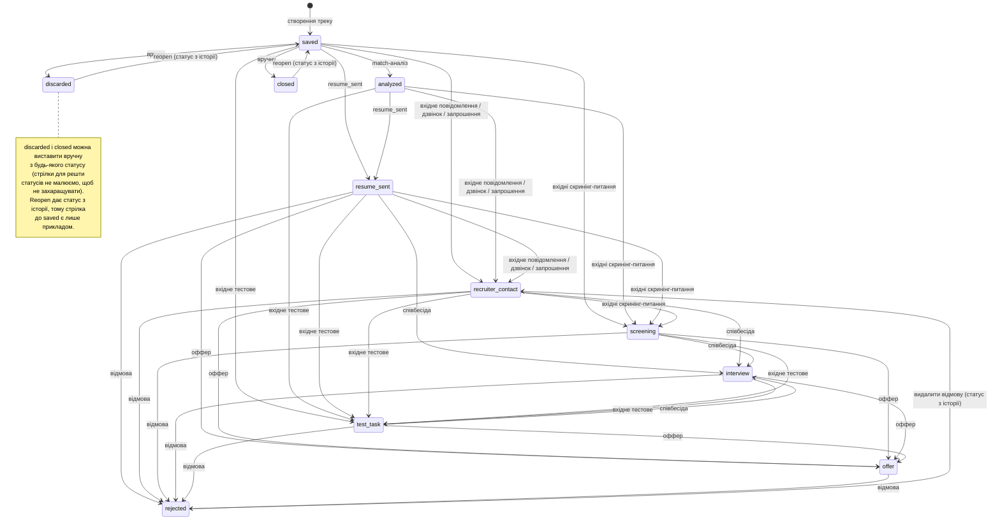

# Tracked Vacancy: статуси та автоматичні переходи

Цей документ описує, як змінюється статус відстежуваної вакансії (`TrackedVacancy`): що робить людина, що робить система автоматично, і що заборонено.

## 1. Три незалежні осі

Стан відстежуваної вакансії складається з трьох незалежних полів. Вони не обов'язково змінюються разом: вакансія може бути `analyzed` + `consider_later`.

| Поле | Що означає | Хто змінює |
|---|---|---|
| `status` | Де вакансія в процесі (див. розділ 3) | Автоматично від interactions або вручну (розділ 4) |
| `priority` | `low` / `medium` / `high` — власне ранжування | Людина (відмова теж ставить `low`) |
| `decision` | `interested` / `consider_later` / `not_interested` — власне рішення | Людина (крім відмови, див. нижче) |

Дати: `applied_at` (коли відправлено резюме), `closed_at` (коли робота з вакансією завершилась), `next_action_at` (нагадування).

## 2. Життєвий цикл словами

1. Вакансію додають до каталогу і, за бажанням, аналізують окремо: це не трекінг.
2. Коли вирішено подаватись, створюється трек: вакансія × конкретне резюме. Початкові значення: `saved`, `priority=low`, `decision=interested`.
3. Match-аналіз переводить `saved` → `analyzed`. `priority` і `decision` він не змінює.
4. Далі людина вирішує: подаватись, відкласти (`consider_later`), відкинути.
5. Після подачі статус рухають interactions: повідомлення, співбесіди, тестові завдання, оффер, відмова.
6. Завершити роботу з вакансією можна кількома шляхами: відмова компанії (`rejected`), власне рішення відкинути (`discarded`), вакансія закрилась (`closed`).

Контакт із рекрутером починається тоді, коли **він** написав чи подзвонив. Твої вихідні повідомлення й подача резюме контактом не вважаються: це могла бути ATS чи бот.

## 3. Статуси

| Статус | Значення | Як виникає |
|---|---|---|
| `saved` | Вакансію збережено | Створення треку |
| `analyzed` | Зроблено match-аналіз | Автоматично після match-аналізу зі `saved` |
| `resume_sent` | Резюме відправлено | Interaction `resume_sent` |
| `recruiter_contact` | Рекрутер вийшов на зв'язок | Вхідні `message`, `call`, `interview_invitation` |
| `screening` | Вхідні скринінг-питання | Вхідне `screening_questions` |
| `interview` | Почався етап співбесід (домовлених чи проведених; деталі — в interactions) | `hr_interview`, `technical_interview`, `final_interview` |
| `test_task` | Отримано тестове завдання | Вхідне `test_task` |
| `offer` | Отримано оффер | Вхідний `offer` |
| `rejected` | Відмовили (або відмовила сама) | Interaction `rejection` |
| `discarded` | Відкинуто власним рішенням | Тільки вручну |
| `closed` | Вакансія закрилась, працювати з нею більше немає сенсу | Тільки вручну |

`rejected`, `discarded`, `closed` — завершальні.

## 4. Ручні дії зі статусом

Через `PATCH` треку статус можна виставити лише `discarded` або `closed`. Інші дії:

- у `discarded` або `closed` з будь-якого статусу;
- повернення в роботу з `discarded` або `closed` — окрема дія `POST /tracked-vacancies/{id}/reopen`. Статус і дати перераховуються з історії interactions (розділ 8). Через `PATCH` так не можна: `saved` або `analyzed` на закритому треку дає `409`;
- усі інші статуси (`resume_sent` … `offer`, `rejected`) вручну не виставляються: їх дають лише interactions. Спроба дає `409`.

Скасувати помилкову відмову (`rejected`) можна лише видаленням interaction `rejection`: статус тоді перерахується з решти історії. `PATCH` тут не допоможе, бо відмова лишається в історії, і перерахунок повернув би `rejected`.

Дії «Відкинути» і «Закрити» на фронтенді мають ставити поля разом:

| Дія | Поля |
|---|---|
| Відкинути | `status=discarded`, `priority=low`, `decision=not_interested` |
| Закрити | `status=closed`, `decision=not_interested` |

`closed_at` бекенд ставить сам, якщо його не передано: «зараз». Це момент, коли ти помітила закриття, а не історична дата закриття вакансії на сайті.

Через `PATCH` треку поля `applied_at`, `closed_at` і `next_action_at` можна задати вручну. Вони можуть розійтися з історією до наступного перерахунку (розділ 8).

## 5. Interactions: обмеження напрямку

| Тип | Правило |
|---|---|
| `resume_sent` | Лише `outgoing`; лише один на трек |
| `offer` | Лише `incoming` |
| `rejection` | Напрямок обов'язковий (відмовити може й кандидат) |
| Решта | Напрямок необов'язковий |

Порушення правила напрямку дає `400`, порушення статусу — `409` (розділ 7).

## 6. Автоматичні переходи

Під час перерахунку (видалення interaction, зміна `occurred_at`, повернення через `reopen`) правила застосовуються в порядку `occurred_at` (при однаковій даті — за id). Початковий статус: `analyzed`, якщо є match-аналіз, інакше `saved`.

Під час створення нового interaction правило застосовується до поточного статусу, а події йдуть у порядку внесення. Тому статус після створення може відрізнятись від того, що дав би перерахунок за датами (див. розділ 8).

| Подія | З яких статусів | Новий статус |
|---|---|---|
| `resume_sent` (outgoing) | `saved`, `analyzed` | `resume_sent` |
| `message`, `call`, `interview_invitation` (incoming) | `saved`, `analyzed`, `resume_sent` | `recruiter_contact` |
| `screening_questions` (incoming) | `saved`, `analyzed`, `resume_sent`, `recruiter_contact` | `screening` |
| `hr_interview`, `technical_interview`, `final_interview` (будь-який напрямок) | `resume_sent`, `recruiter_contact`, `screening`, `test_task` | `interview` |
| `test_task` (incoming) | `saved`, `analyzed`, `resume_sent`, `recruiter_contact`, `screening`, `interview` | `test_task` |
| `offer` (incoming) | `resume_sent`, `recruiter_contact`, `screening`, `interview`, `test_task`, `offer` | `offer` |
| `rejection` | `resume_sent`, `recruiter_contact`, `screening`, `interview`, `test_task`, `offer` | `rejected` |

Побічні ефекти:

- `resume_sent`: `applied_at` = дата події.
- `rejection`: `closed_at` = дата події; при створенні також `priority=low`, `decision=not_interested`.

Типи, які статус **не** змінюють: `feedback`, `offer_discussion`, вихідні `message`/`call`/`screening_questions`/`test_task`/`interview_invitation`.

Однакові стани не чіпаємо: якщо трек уже в статусі, куди веде правило, нічого не змінюється.

## 7. Заборони

| Що | Заборонено, коли |
|---|---|
| `hr_interview`, `technical_interview`, `final_interview` | Статус `saved` або `analyzed` (спершу має бути перший контакт) |
| `offer`, `offer_discussion` | Статус `saved`, `analyzed`, `rejected`, `discarded`, `closed` |
| `rejection` | Статус `saved`, `analyzed`, `rejected`, `discarded`, `closed` |
| Все, крім `message`, `call`, `feedback` | Статус `rejected`, `discarded`, `closed` |
| Другий `resume_sent` | Якщо вже є один на цьому треку |

Коди: заборони статусу дають `409`, порушення напрямку дають `400`.

Щоб продовжити роботу з закритим треком: для `discarded` і `closed` спершу `POST /tracked-vacancies/{id}/reopen`; для `rejected` спершу видалити interaction `rejection` (`reopen` для нього не працює).

`feedback` дозволений завжди, і статус він не змінює: фідбек часто приходить уже після відмови. Остаточне «ми йдемо з іншими кандидатами» — це `rejection` (причину пиши в `message_text`), а не `feedback`.

## 8. Редагування, видалення й дати

- `PATCH /tracked-vacancies/interactions/{id}` приймає лише `summary`, `message_text`, `occurred_at`. Інші поля (зокрема `interaction_type` і `direction`) дають `422`: помилку виправляють видаленням через `DELETE /tracked-vacancies/interactions/{id}` і повторним внесенням.
- Після видалення interaction, після зміни `occurred_at` і після `reopen` статус перераховується: береться вся історія interactions, що лишилась, у порядку `occurred_at` (а за id при однаковій даті), і проганяється через таблицю з розділу 6. Interaction без дати стають у кінець. Ручні `discarded` і `closed` перерахунок не чіпає.
- `priority` і `decision` перерахунок не змінює. Після видалення `rejection` вони лишаються `low` і `not_interested`, і їх треба виставити вручну.
- `applied_at` = дата `resume_sent`, `closed_at` = дата `rejection`. Ці поля синхронізуються під час перерахунку: зміна `occurred_at` у такому записі, видалення `resume_sent` (очищає `applied_at`) або видалення `rejection` (очищає `closed_at`). Для `discarded` і `closed` `closed_at` не чіпається: це твоя ручна дата закриття.
- Після перерахунку результат залежить від дат, а не від порядку внесення. Під час створення нового interaction порядок внесення впливає на статус (розділ 6), тому вноси події хронологічно: тоді статус збігається з тим, що дав би перерахунок.

## 9. Діаграма станів

